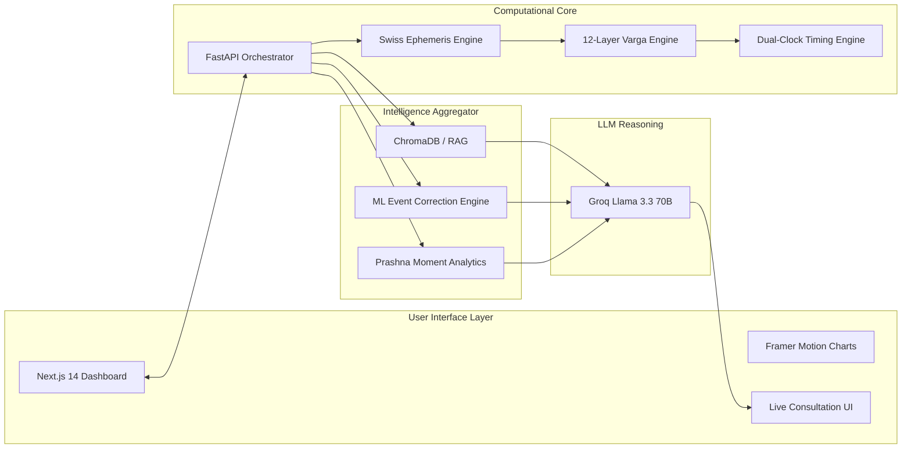
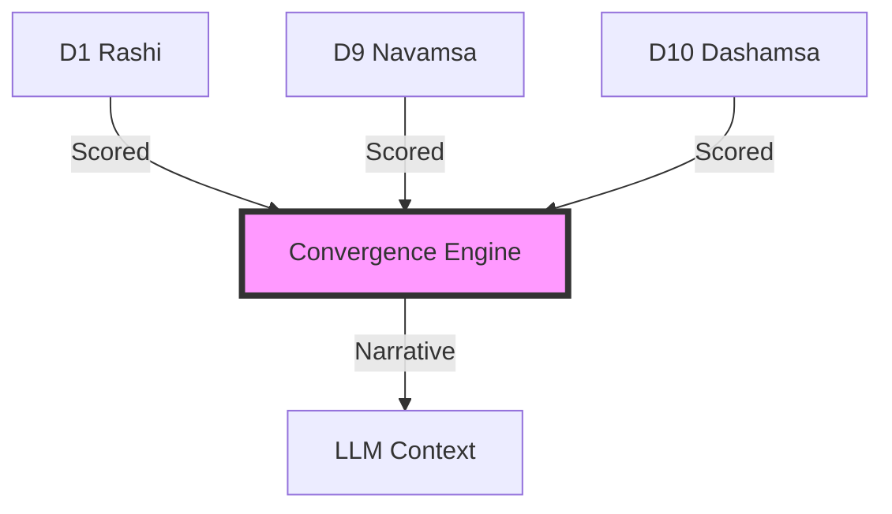
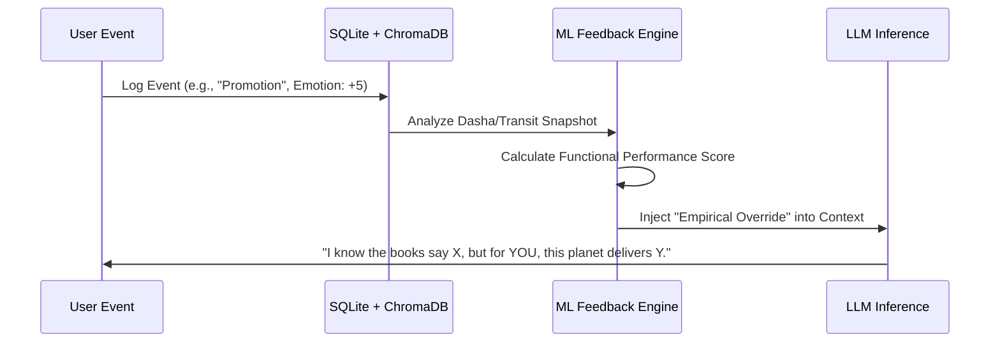

# Astro.AI (Jyotish Oracle) — Advanced System Architecture

**Document Purpose:** To provide a comprehensive technical and astrological architectural breakdown for AI Engineers and Vedic Astrologers. This document details how the system transitions from a standard LLM chatbot into a highly advanced, mathematically precise, and empirically self-correcting Digital Jyotishi.

---

## 1. High-Level System Philosophy

The core philosophy of Astro.AI is **"Convergence and Lived Experience."** It does not merely parse ephemeris data to an LLM. Instead, it utilizes a multi-layered, pre-computation pipeline to synthesize conflicting charts, track temporal physics, and apply machine learning to the user's logged history before the LLM ever sees a prompt.

### Architectural Overview

---

## 2. Technical Implementation Stack

### 2.1 Backend (Computational Core)
*   **Language:** Python 3.12+ (Utilizing `asyncio` for non-blocking astronomical computations).
*   **API Framework:** **FastAPI** — High-performance asynchronous API layer.
*   **Ephemeris:** **Swiss Ephemeris (via Kerykeion)** — Sub-second precision for planetary longitudes (essential for Varga calculations).
*   **Persistence (Relational):** **SQLite** — Stores structured life events, user profiles, and birth data.
*   **Persistence (Vector):** **ChromaDB** — High-performance vector database for semantic search (RAG) and ML feedback loops.

### 2.2 Frontend (Archival Dashboard)
*   **Framework:** **Next.js 14+ (App Router)** — Server-side rendering for ultra-fast load of complex charts.
*   **Library:** **React 18** — Interactive consultation interface.
*   **Styling:** **Tailwind CSS** — "Archival" design system with deep zinc/cream tones.
*   **Animations:** **Framer Motion** — Powers the SVG "Blueprint" chart animations and staggered data reveals.

### 2.3 AI & Inference Layer
*   **Primary LLM:** **Llama 3.3 70B (via Groq)** — Master reasoning engine (200+ tokens/sec).
*   **Local Fallback:** **Ollama** — For local inference and privacy-sensitive data.
*   **Embeddings:** **nomic-embed-text** — Vector embeddings for the Event Correction Engine.

---

## 3. Core Astrological Engines

The system relys on a pre-computation pipeline that processes raw data into high-level insights *before* LLM inference.

### 3.1 The Divisional Chart (Varga) Engine
Calculates the 12 key harmonic charts based strictly on **BPHS rules**. 
*   **Calculated Vargas:** D1 through D60.
*   **Varga Devatas:** Computes the micro-degree deity proxy for the D60 chart (e.g., *Kroora* vs. *Saumya*).

### 3.2 The Convergence Reasoning Engine (D1 vs D9 vs D10)
Instead of raw data, the backend passes a **Dignity Gap** analysis.

*   **Output:** If D1 is weak but D9/D10 are strong, the engine generates: *"Planet underperforms in surface personality but delivers powerfully at soul and career level. Late recognition."*

### 3.3 The Dual-Clock Predictive System
A world-class astrologer uses multiple clocks. Astro.AI runs **Vimshottari (Moon-based)** and **Jaimini Chara (Sign-based)** simultaneously.
*   **Synthesis:** A convergence between the Vimshottari Lord and the Jaimini Sign provides a 95% confidence interval for life events.

### 3.4 Shadbala & Bhava Bala (Recalibrated)
Incorporates Sthana, Dig, Kala, and Chesta Bala. Bhava Bala is dynamically modified by the **Ashtakavarga (SAV) points**.

---

## 4. The Intelligence Aggregator (ML Feedback)

### 4.1 Event Correction Engine (Machine Learning Feedback)
The most advanced feature: The system corrects its own astrological theory based on the user's history.

---

## 5. Next Steps: Evolving the "Real Astrologer"

1.  **Synthetic Chart Rectification:** Reverse-engineering birth times from event logs.
2.  **Transits to Ashtakavarga Kakshyas:** 3°45' orbital subdivision tracking.
3.  **Bhrigu Bindu Calculation:** Adding mathematical destiny midpoints.

### *Feedback Request:*
What mathematical layer (e.g., Yogini Dasha, Tajika charts) is currently missing that you believe is the defining hallmark of a Master Jyotishi?
